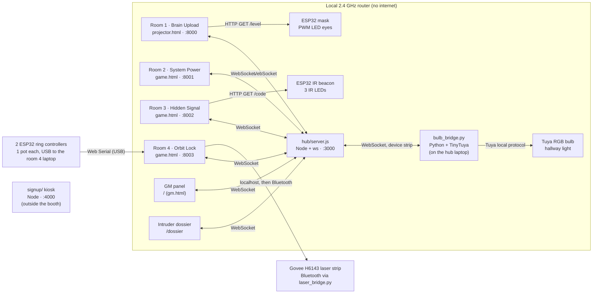

# NEXUS: The Core Protocol

A multi-room escape room built for the ICpEP.se booth at LWeek 2026 (October 5–9). Teams "upload their heads" into Aurora, a rogue AI, and work through four linked rooms to shut her down. Each room runs on its own laptop. The laptops, the ESP32-driven props and a game-master panel all talk through one local WebSocket hub.

The booth is open to the whole university, so the puzzles test observation and teamwork rather than engineering knowledge. The engineering is in the system that runs them.

<!-- TODO: add a 60–90 s video or GIF of a run, plus photos of the mask and the IR beacon -->

## Highlights

- **Networked rooms.** Five game pages, a GM panel and ESP32 props stay in sync over a Node.js WebSocket hub on a local router with no internet.
- **Hardware props.** An ESP32 drives the wall mask's LED eyes when the projected cursor hovers over it. A second ESP32 blinks a hidden code on 940 nm IR LEDs that only phone cameras can see. Two more are Room 4's ring controllers: one potentiometer each, streamed to the browser over USB with Web Serial.
- **Fail-safe by design.** The laptop page is the single source of truth. ESP32s only execute commands, keep a safe default when Wi-Fi drops, and cycle through backup networks. Every room has staff override keys, and the GM can press them remotely.
- **State that carries over.** Each room hands one resource (SYNC, POWER, TRACE, HUMAN) to the finale, and an "intruder dossier" replays the team's run.
- **Front of house.** A keyboard-only ticket kiosk handles sales, time slots, party limits, staff-PIN payments and voids. It keeps an append-only sales log that rebuilds its state after a crash.
- **No build step.** Plain HTML, CSS and JavaScript on canvas, with a CRT/glitch look tuned to run smoothly on a projector laptop.

## Architecture



- Rooms unlock in order: each game sends `pNdone` through the hub, and the next room leaves standby.
- Games report `status` every second. The GM panel turns those reports into room cards (OFFLINE / LOCKED / READY / PLAYING / CLEARED) with run clocks and remote staff keys.
- The hub stores the last command for each device and replays it on reconnect, so a prop that reboots comes back in the right state.
- The hub runs on whichever laptop is the GM laptop and restarts itself if it crashes. The current run is saved to `hub/run.json`, and a game page that reconnects mid-run gets the run's unlocks again. Games queue their results while the hub is down, so a crash or a rebooted room laptop costs a few seconds, not the team's progress.

## The rooms

| # | Room | What players do | Tech |
|---|------|-----------------|------|
| 1 | Brain Upload | Drag the cursor off the laptop onto the projected wall, click the physical mask and decode 4-bit binary groups. | Extended display, canvas hotspot calibration, ESP32 PWM |
| 2 | System Power | Type words to charge a draining meter while one player holds a giant plush Enter key to keep the hallway lit. Staff "AIs" advance whenever it goes dark. | Adaptive word difficulty, key-hold detection, Tuya smart bulb driven locally through a Python bridge |
| 3 | Hidden Signal | Find a beacon that is invisible to the eye by looking through a phone camera. Count the IR blinks. | ESP32, 940 nm IR LEDs, per-reset random codes |
| 4 | Orbit Lock | Turn two shield rings around Aurora's heart until both gaps line up with the laser, then fire. Four layers: her drift, watchdog drones that eat the beam, and an emitter she moves after every miss. 2 ESP32 knob controllers over USB (Web Serial), Govee strip over Bluetooth (Python bridge), canvas renderer with pre-blurred glow sprites (no shadowBlur or CSS filters), synthesized laser audio |
| 5 | Everywhere At Once | Game 4's win is fake: the save stalls at 97% and Aurora crashes back in, talking in an Undertale-style box. She takes over every room's laptop. Room 3 becomes the map; rooms 1, 2 and 4 get her tasks (binary, hard words, a two-knob crosshair), which jump between rooms. The kill switch: three rooms press at the same moment while the team counts down across the tarps. | `boss.js` loaded into every room page from the hub; hub-owned state; clock sync for the kill switch; low-res pixel canvas |

The full design notes, including flows, hint ladders, materials and safety rules, are in [nexus-core-protocol-context.md](nexus-core-protocol-context.md).

## Repository layout

```
hub/                      Node WebSocket hub, GM panel, dossier, beacon stand-in, the finale (public/boss.js)
puzzle1-brain-upload/     projector page, mask_esp32/ sketch, SETUP.md (wiring + booth setup)
puzzle2-system-power/     typing / power game, SETUP.md (hallway bulb + bridge)
puzzle3-hidden-signal/    IR hunt game, beacon_esp32/ sketch
puzzle4-orbit-lock/       ring-and-laser game, pots_esp32/ sketch, laser_bridge.py (Govee strip), SETUP.md
signup/                   ticket + queue kiosk (no dependencies)
```

## Running it

Requirements: Node.js 18+, Python 3 (static file server for the game pages), Chrome or Edge. On any laptop that may run the hub: `python -m pip install tinytuya websocket-client` (for the Puzzle 2 bulb bridge). For the props: Arduino IDE with the ESP32 core 3.x. On a fresh Windows computer, run [FreshStart.bat](FreshStart.bat) once with internet: it installs all of that (except the Arduino IDE), and the hub's npm packages.

The booth uses one computer per job: four room laptops, the GM laptop (hub + GM panel) and the signup PC. The finale (game 5) runs on the four room laptops.

Any laptop can take any job. Copy the whole folder to every laptop, then:

1. GM laptop (exactly one): run `hub\start.bat`. It runs `npm install` the first time, then starts the hub and opens the GM panel.
2. Each room laptop: run that room's `start.bat`. The signup PC: `signup\start.bat`.

No IPs are typed in. Every page searches for the hub: its own laptop first, then the last hub it found, then every address on the booth network (`NET` in [booth.bat](booth.bat), `192.168.0` by default) at once. The hub learns the signup PC's address when the kiosk connects, and the GM panel shows the URLs to open on the beacon phones. Every launcher also keeps its laptop from sleeping. `?hub=<IP>` on a page's URL skips the search. Every game also works without the hub or the hardware: staff keys (Ctrl+Alt+H shows them) unlock and force each step, so any room can be tried on its own.

Booth credentials are in the repo, so a clone runs as is:
- **ESP32 Wi-Fi:** `secrets.h` in each sketch folder (NexusV only).
- **Puzzle 2 bulb key:** `puzzle2-system-power/devices.json`, from `python -m tinytuya wizard` (see its SETUP.md).
- **Hallway camera login:** `signup/camera.json`.

## Tests

```sh
cd hub && npm test                      # starts its own hub: relay, state replay, carried resources, GM protocol, restart + re-unlock
node signup/test.js                     # PIN, party limits, slot clashes, ticket cap, voids, restart from log
```

## Credits

Built for ICpEP.se (Institute of Computer Engineers of the Philippines Student Edition) for LWeek 2026.
<!-- TODO: your name, your role, and teammates -->
