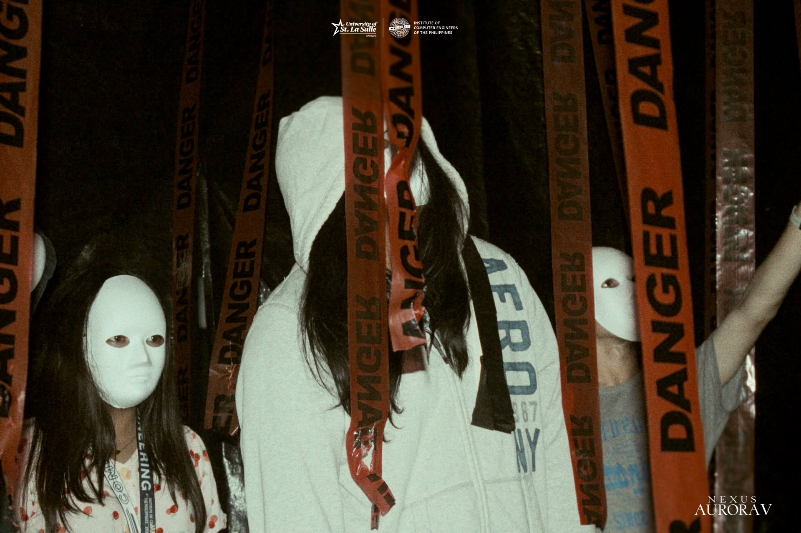
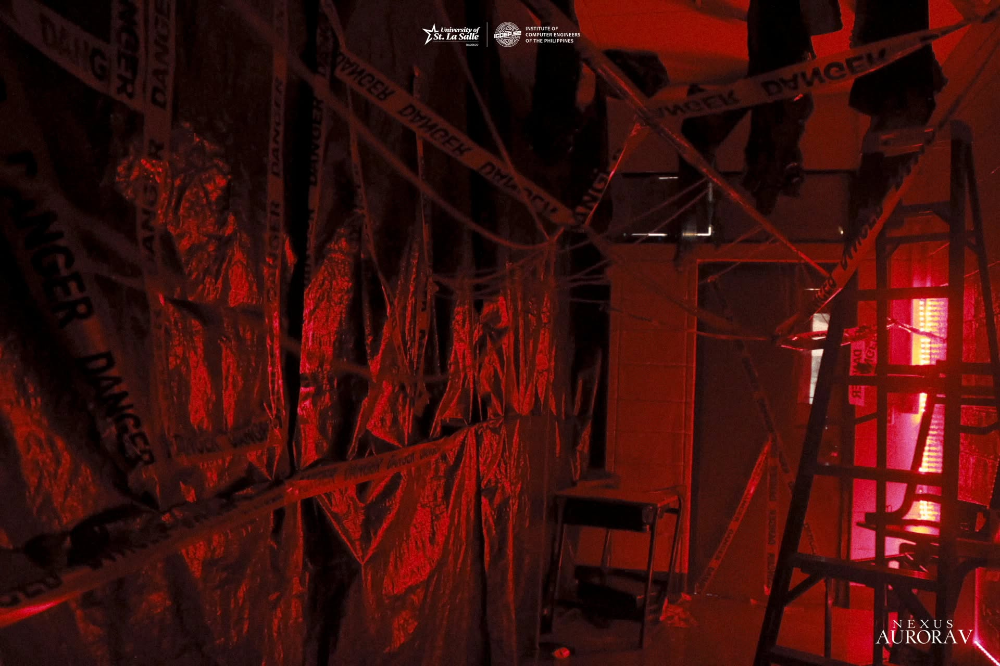
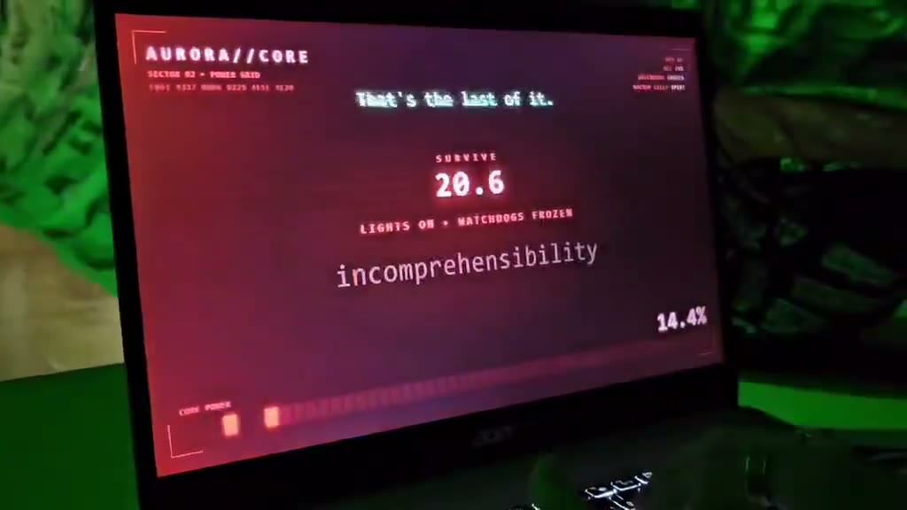
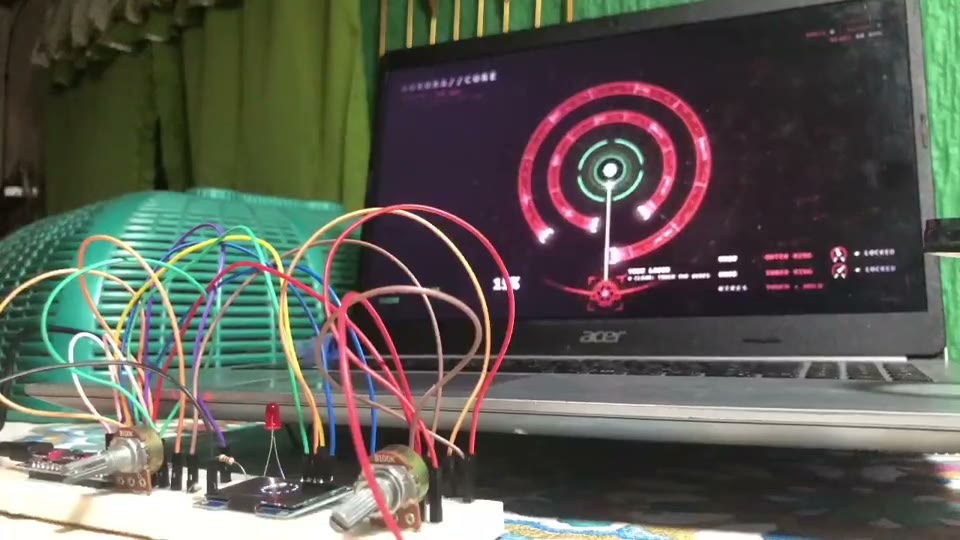
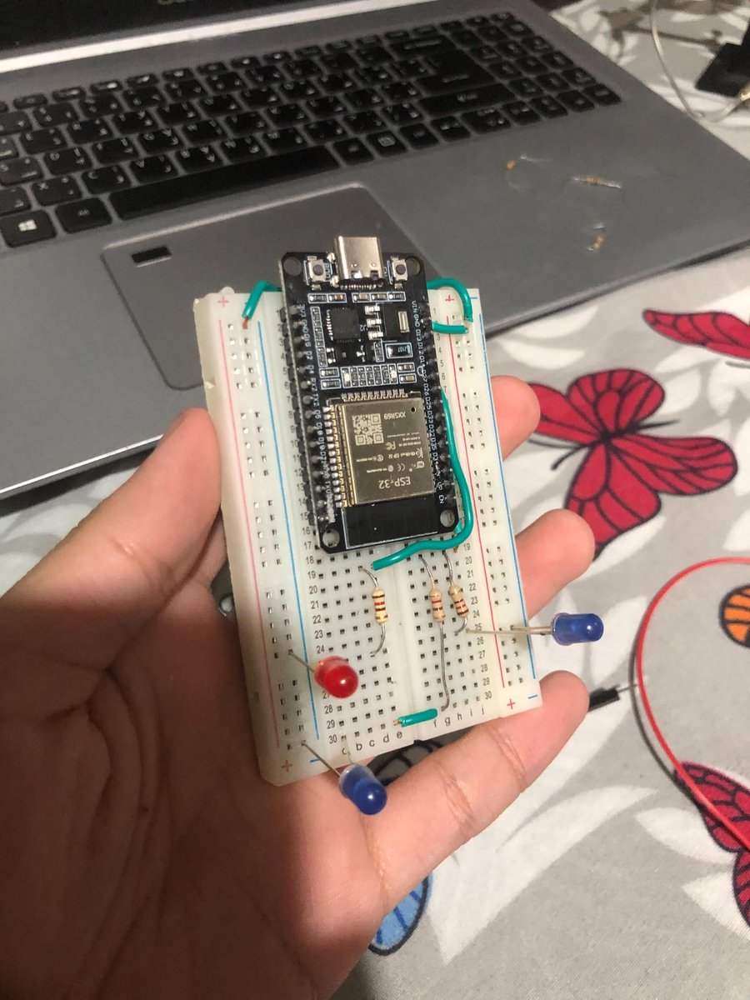
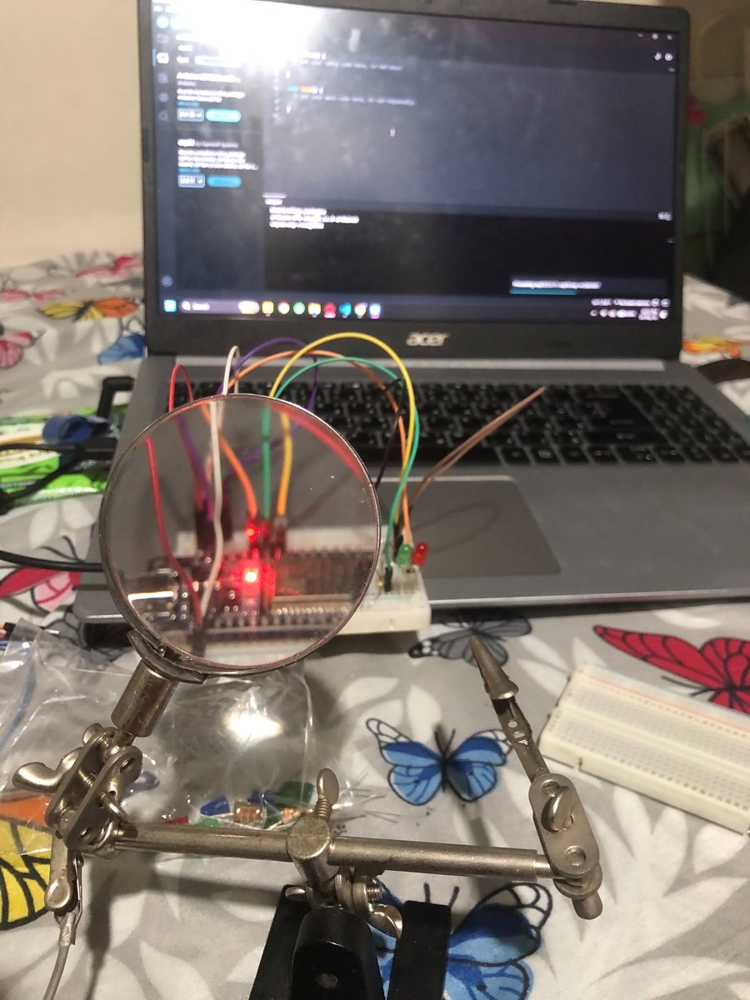
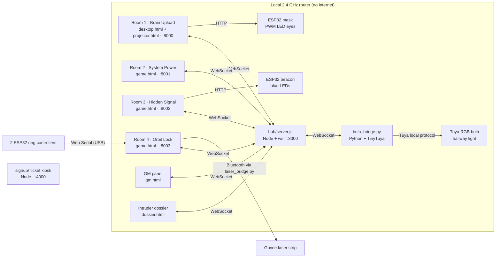
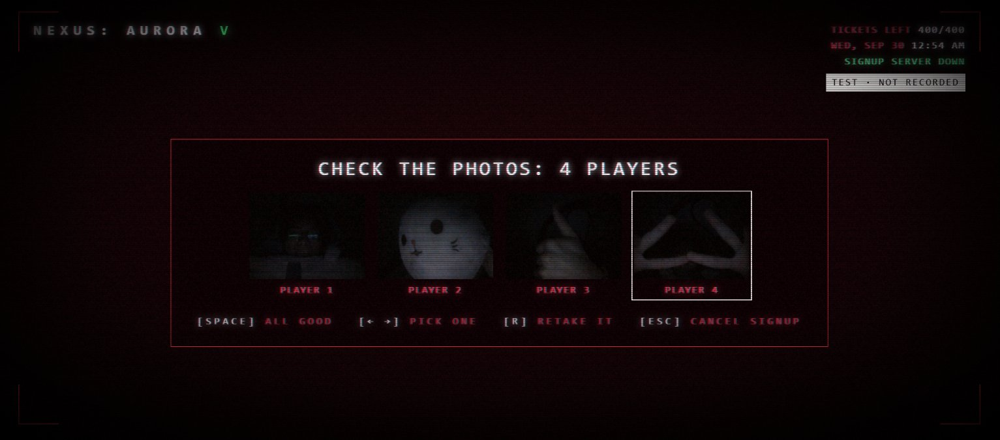

# NEXUS: AURORA V.

A five-stage, multi-room escape room built for the ICpEP.SE – USLS booth at LWeek 2026 (University of St. La Salle, Bacolod). Teams "upload their minds" into Aurora, a rogue AI, and fight their way through four linked rooms and a finale to shut her down.

Each room runs on its own laptop. The laptops, four ESP32 props, a smart bulb, a laser strip and a game-master panel all talk through one Node.js WebSocket hub on an offline local network.

**All 400 tickets sold out, for ₱20,400 in sales.**



<table>
  <tr>
    <td></td>
    <td></td>
  </tr>
</table>

### See it running

<table>
  <tr>
    <td width="50%"><a href="docs/video/rooms-1-2.mp4"></a></td>
    <td width="50%"><a href="docs/video/room-4-controller.mp4"></a></td>
  </tr>
  <tr>
    <td><a href="docs/video/rooms-1-2.mp4">Video: Rooms 1 and 2 during a live run (2:34)</a></td>
    <td><a href="docs/video/room-4-controller.mp4">Video: testing the Room 4 controller (0:57)</a></td>
  </tr>
</table>

## At a glance

| | |
|---|---|
| Event | LWeek 2026, five days |
| Tickets | 400 sold (sold out), ₱20,400 |
| Format | 4 rooms + a finale that takes over all 4 rooms at once, 23-minute limit per team |
| Booth | 7 computers, 4 ESP32 props, a Tuya smart bulb, a Govee laser strip, a PTZ camera |
| Software | About 11,000 lines of plain JavaScript, HTML, Python and Arduino C++. No frameworks and no build step. |

Ticket sales per day:

| Day | Tickets | Sales (₱) |
|-----|--------:|----------:|
| 1 | 34 | 1,700 |
| 2 | 70 | 3,450 |
| 3 | 108 | 5,650 |
| 4 | 105 | 5,450 |
| 5 | 83 | 4,150 |
| **Total** | **400** | **20,400** |

The booth was open to the whole university, so the puzzles test observation and teamwork, not engineering knowledge. The engineering is in the system that runs them.

## The rooms

| # | Room | What players do | Tech |
|---|------|-----------------|------|
| 1 | Brain Upload | Start the "Mind Upload" app on the laptop. The upload fails at 97% and Aurora takes over the projected wall. Players decode binary to type her password, then survive her attacks as on-screen quick-time events. | Laptop and wall pages linked by a local Node server (SSE + POST), ESP32 mask with PWM LED eyes |
| 2 | System Power | Type words to charge a draining power meter while one player holds a giant plush Enter key to keep the hallway light on. Staff playing "AIs" advance whenever it goes dark. | Adaptive word difficulty, key-hold detection, Tuya bulb driven locally through a Python bridge |
| 3 | Hidden Signal | Find a hidden beacon and count its blue blinks. Three layers, each faster, against a 5-minute trace. | ESP32 beacon, blink timing sent from the page with each code, random codes per reset |
| 4 | Orbit Lock | Turn two shield rings around Aurora's core until both gaps line up with the laser, then fire. Three layers: align, watchdog drones that eat the beam, and an override. | 2 ESP32 knob controllers over USB (Web Serial), Govee strip over Bluetooth, canvas renderer with pre-blurred glow sprites |
| 5 | Everywhere at Once | Room 4's win is fake. Aurora crashes back in, takes over every laptop and talks in an Undertale-style text box. Room 3 becomes the map, rooms 1, 2 and 4 get her tasks, and the kill switch needs three rooms to press at the same moment. | `boss.js` loaded into every room from the hub, hub-owned state, clock sync for the simultaneous press |

Each room hands one resource (SYNC, POWER, TRACE, HUMAN) to the finale, and an "intruder dossier" page replays the team's run at the end.

## Hardware

Every prop is an ESP32 DevKit on a breadboard. The laptop page decides what happens, and the board only executes commands, so the firmware stays small and a board that reboots mid-run gets its last state back from the hub.

<table>
  <tr>
    <td width="50%"></td>
    <td width="50%"></td>
  </tr>
  <tr>
    <td>Room 1 mask: the two blue LEDs become the mask's eyes</td>
    <td>Room 4 controller on the test bench</td>
  </tr>
</table>

| Prop | Inputs and outputs | Link to the game |
|------|--------------------|------------------|
| Room 1 mask ([sketch](puzzle1-brain-upload/mask_esp32/mask_esp32.ino)) | Two blue LED eyes on GPIO 25 through their own 120 Ω resistors, dimmed with 8-bit PWM. Red status LED on GPIO 27. | HTTP from the wall page (`/level?v=0..255`) |
| Room 3 beacon ([sketch](puzzle3-hidden-signal/beacon_esp32/beacon_esp32.ino)) | Three blue LEDs on GPIO 32, 33 and 25 (PWM). Red status LED on GPIO 27. | HTTP: the game sends the whole blink sequence as a list of steps, and the board plays it back |
| Room 4 controller ([sketch](puzzle4-orbit-lock/controller_esp32/controller_esp32.ino)) | Two potentiometers on ADC1 (GPIO 34 and 35, so they work while Wi-Fi is on), averaged over 32 samples with a 3 mV dead band. Two bare "fire" wires on GPIO 13 with a 120 ms debounce. 1.3" SH1106 OLED over I²C. | Server-Sent Events at 50 Hz over Wi-Fi, with Web Serial over USB as the backup |

Each board shows its own Wi-Fi state on a red LED, so staff can diagnose a dead prop at a glance. The full wiring for each prop is in its room's `SETUP.md`.

## Architecture



- **Rooms unlock in order.** Each game sends `pNdone` through the hub, and the next room leaves standby.
- **The GM panel is one screen.** Games report their status every second. The panel turns those reports into room cards with run clocks, the team's time left, remote staff keys, a chat box into every room, sound pads and the hallway light controls.
- **Props are dumb on purpose.** The laptop page is the single source of truth. ESP32s only execute commands and fall back to a safe default when Wi-Fi drops. The hub stores the last command for each device and replays it on reconnect, so a prop that reboots comes back in the right state.
- **A crash costs seconds, not progress.** The hub restarts itself, saves the current run to disk and re-sends a run's unlocks to any page that reconnects. Games queue their results while the hub is down.
- **No IPs to type.** Every page looks for the hub on its own laptop, then at the last address it found, then across the whole booth subnet at once. Any laptop can take any job.

## What running it live taught me

The first version worked in testing. Five days in front of real crowds found what testing didn't. Every fix below shipped overnight between event days.

- **Players don't read instructions.** On day 1, most teams missed the hint to move the mouse onto the projected wall, mistook a reference table for a button and counted the wrong blinking light. I cut the second-screen trick, turned Room 1 into a single app that drives the wall, slowed Room 3's beacon down to a pace you can count by eye and cut Room 4's training to two steps.
- **A crowd breaks Wi-Fi.** With the hall full, the room laptops went quiet for seconds at a time, and the hub's 2-second timeout marked them offline. I raised it to 15 seconds and added a script that turns off Windows Wi-Fi power saving.
- **One bad frame took down the hub.** A malformed WebSocket frame threw an unhandled socket error, and the restart dropped every room. The hub now catches socket errors per connection and writes a log file.
- **Browsers throttle what they can't see.** Chrome stopped rendering the projector window whenever another window covered it, which froze Room 1 at 97%. The launchers now start the browser with background throttling turned off.
- **Some bugs never get a root cause.** The ticket kiosk went black at random. I never found out why, so I added a system-wide restart hotkey that works in the black state and saves a screenshot each time it is pressed.

## Front of house

The ticket kiosk in `signup/` runs outside the booth. Its registration and reservation backend was built by Jeremiah Monebit. It is keyboard-only and handles sales, time slots, party sizes, booking for later and voids. It writes an append-only sales log and rebuilds its state from that log after a crash. Team photos taken at signup appear again in the finale. The GM can pop a hallway camera feed (go2rtc) up on the kiosk screen.



## Repository layout

```
hub/                      WebSocket hub, GM panel, dossier, finale (public/boss.js), voice lines and SFX
puzzle1-brain-upload/     laptop + wall pages, local link server, mask_esp32/ sketch
puzzle2-system-power/     typing game, bulb_bridge.py (hallway bulb)
puzzle3-hidden-signal/    beacon hunt game, beacon_esp32/ sketch
puzzle4-orbit-lock/       ring-and-laser game, controller_esp32/ sketch, laser_bridge.py
signup/                   ticket kiosk and hallway camera
aurora-voice/             script that cuts Aurora's recorded lines into clips
docs/                     design notes, photos and videos
```

Each room folder has a `SETUP.md` with the wiring and booth setup. The full design notes, including flows, hint ladders, materials and safety rules, are in [docs/design-notes.md](docs/design-notes.md).

## Running it

Requirements: Node.js 18+, Python 3, Chrome or Edge, and the Arduino IDE with ESP32 core 3.x for the props. On the hub laptop, also run `python -m pip install tinytuya websocket-client` for the bulb bridge. On a fresh Windows computer, [FreshStart.bat](FreshStart.bat) installs everything except the Arduino IDE.

1. On the GM laptop (exactly one), run `hub\start.bat`. It installs the hub's packages the first time, starts the hub and opens the GM panel.
2. On each room laptop, run that room's `start.bat`. On the signup PC, run `signup\start.bat`.

Every game also runs without the hub or the hardware. Staff keys (Ctrl+Alt+H lists them) unlock and force each step, so any room can be tried on its own.

The booth ran on its own offline router, and its Wi-Fi and device credentials are committed so that a fresh clone runs as is.

## Tests

```sh
cd hub && npm test        # starts its own hub: relay, state replay, carried resources, GM protocol, restart + re-unlock
node signup/test.js       # party limits, slot clashes, ticket cap, voids, restart from the sales log
```

## Credits

- **Francis Duco**, President of ICpEP.SE – USLS (A.Y. 2026–2027): concept, game design, software and hardware.
- **Jeremiah Monebit**: the core backend of the signup booth (registration and reservations).

Built for and run by [ICpEP.SE – USLS](https://www.facebook.com/icpepusls) (Institute of Computer Engineers of the Philippines, Student Edition, University of St. La Salle) at LWeek 2026.

The booth's music is from the soundtrack of *Watch Dogs* (Ubisoft). It is used without affiliation, and all rights to it belong to its owners. Aurora's voice lines were generated with ElevenLabs.

## License

All rights reserved. The code is public for viewing only. Third-party material, including the *Watch Dogs* music, is not covered. See [LICENSE](LICENSE).
